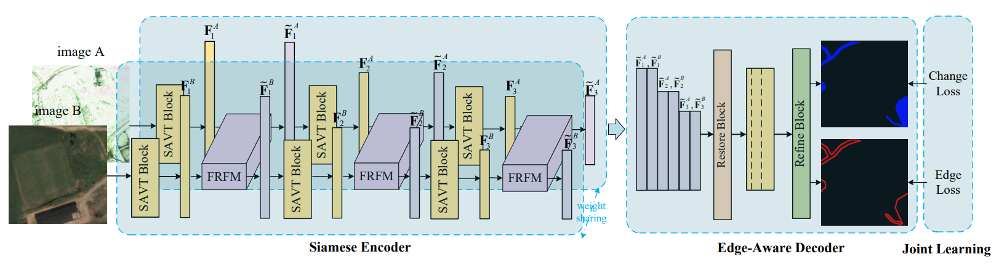

# EATDer

This repository provides the code for the methods and experiments presented in our paper '**EATDer: Edge-Assisted Adaptive Transformer Detector for Remote Sensing Change Detection**'. (TGRS2024)





**If you have any questions, you can send me an email. My mail address is 1465000727@qq.com**

## Datasets

Download the building change detection dataset. 

- [WHU-CD](https://study.rsgis.whu.edu.cn/pages/download/)
- [LEVIR-CD](https://justchenhao.github.io/LEVIR/)
- [SYSU-CD](https://github.com/liumency/SYSU-CD)

Prepare datasets into following structure,

```
├─train
    ├─A
    ├─B
    ├─label
├─val
    ├─A
    ├─B
    ├─label
├─test
    ├─A
    ├─B
    ├─label
```

In the following experiments, each image in the dataset is pre-cropped into multiple image patches of size 256 × 256.


## Preparation

* Install dependencies using pip install -r requirements.txt

* Change the root address in datamaker.py to the address of the dataset you want to train on. For example: root = 'D:\dataset\CDD'

* Run datamaker.py to generate edge and edge_slim folders in each dataset and create the corresponding edge data for training.

**Attention:** 

* Other versions of Python and PyTorch may cause compilation errors.

* please confirm that the names of the images in A, B, and label are the same, and there is no hidden .ini file


## Train

* Change the root address in the train section to your dataset address, for example: root = 'D:\dataset\CDD'.

* Run train.py to start training. ~


